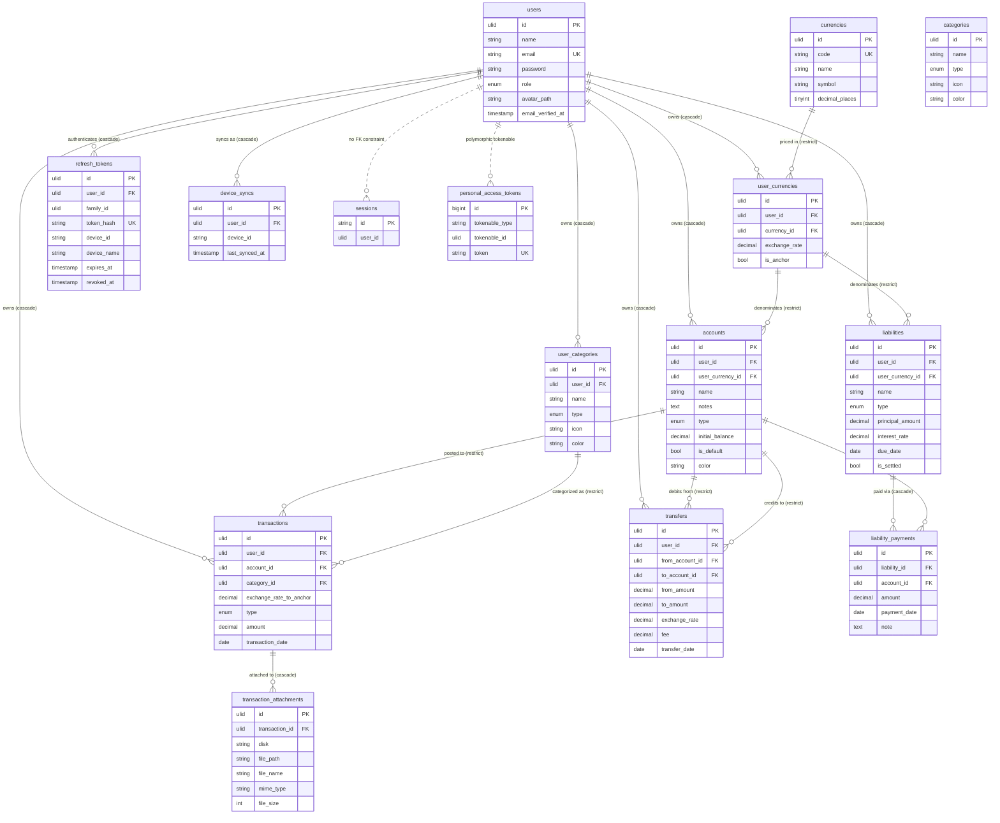

# Server Database Schema — Wallet BE

_Version **1.1.0** — 2026-07-24 · see [Changelog](#changelog)_

The authoritative PostgreSQL schema, derived from the migrations in `database/migrations`. This is the source of truth that the [Android Room mirror](/docs/android-room-schema) shadows for offline-first sync.

## Conventions

| Aspect | Convention |
|---|---|
| Primary keys | **ULID** (`char(26)`) on all domain tables, generated app-side. Exceptions: `personal_access_tokens` and `jobs`/`failed_jobs` use auto-increment `bigint`; `cache`, `sessions`, `job_batches`, and `password_reset_tokens` use string keys. |
| Money | `decimal(15,2)`, always `unsigned` / `CHECK (> 0)` for amounts. Direction is carried by a `type` enum, never a signed amount. |
| Exchange rates | `decimal(20,6)` (transactions / user_currencies) or `decimal(15,6)` (transfers). Snapshotted at write time, never recalculated against live rates. |
| Dates | `date` for user-facing calendar dates (no timezone). `timestamp` for `created_at` / `updated_at` / `deleted_at`. |
| Soft deletes | `deleted_at` (`softDeletes()`) on every domain table. `deleted_at` doubles as a tombstone for sync. |
| Sync cursor | `updated_at`. Every syncable table has an `(user_id, updated_at)` index for delta pulls. |
| Enums | Modeled as `varchar` + a `CHECK` constraint on PostgreSQL (Laravel's default). |

---

## Domain tables

### `users`
| Column | Type | Constraints / Notes |
|---|---|---|
| `id` | ulid | PK |
| `name` | string | |
| `email` | string | unique |
| `email_verified_at` | timestamp | nullable |
| `password` | string | hashed |
| `role` | enum(`super_admin`,`user`) | default `user` |
| `avatar_path` | string | nullable — profile picture path/URL (added v1.1.0) |
| `remember_token` | string | nullable |
| `created_at` / `updated_at` | timestamp | |

### `currencies` — reference data (global, soft-deletable)
| Column | Type | Constraints / Notes |
|---|---|---|
| `id` | ulid | PK |
| `code` | string | unique — `USD`, `IDR`, `EUR` |
| `name` | string | `US Dollar` |
| `symbol` | string | `$`, `Rp` |
| `decimal_places` | tinyint unsigned | default `2` |
| `deleted_at` | timestamp | soft delete |
| `created_at` / `updated_at` | timestamp | |

### `user_currencies` — a user's enabled currencies + FX rates
| Column | Type | Constraints / Notes |
|---|---|---|
| `id` | ulid | PK |
| `user_id` | ulid | FK → `users` · **cascade** on delete |
| `currency_id` | ulid | FK → `currencies` · **restrict** on delete |
| `exchange_rate` | decimal(20,6) | default `1` — rate to the user's anchor |
| `is_anchor` | boolean | default `false` |
| `created_at` / `updated_at` | timestamp | |

**Unique:** `(user_id, currency_id)`. **No soft delete** and no delete endpoint — rows are referenced historically by accounts/transactions and must never be removed (guarded by an Eloquent `deleting` event).

### `categories` — reference data (global, soft-deletable)
| Column | Type | Constraints / Notes |
|---|---|---|
| `id` | ulid | PK |
| `name` | string | `Food`, `Transport`, `Salary`… |
| `type` | enum(`income`,`expense`) | |
| `icon` | string | icon key for mobile UI |
| `color` | string | nullable — hex |
| `deleted_at` | timestamp | soft delete |
| `created_at` / `updated_at` | timestamp | |

> As of v1.1.0 this table is a **read-only default/template** only. Transactions no longer reference it — the mobile client reads this list (via sync-pull / `GET /categories`) and seeds per-user rows into `user_categories`.

### `user_categories` — a user's own categories (added v1.1.0)
| Column | Type | Constraints / Notes |
|---|---|---|
| `id` | ulid | PK |
| `user_id` | ulid | FK → `users` · **cascade** on delete |
| `name` | string | |
| `type` | enum(`income`,`expense`) | |
| `icon` | string | icon key for mobile UI |
| `color` | string | nullable — hex |
| `deleted_at` | timestamp | soft delete |
| `created_at` / `updated_at` | timestamp | |

**Index:** `(user_id, updated_at)`. User-owned and writable via `POST /sync/push` (entity `user_category`). Seeded client-side from the global `categories` template; users may add their own.

### `accounts`
| Column | Type | Constraints / Notes |
|---|---|---|
| `id` | ulid | PK |
| `user_id` | ulid | FK → `users` · **cascade** |
| `notes` | text | nullable |
| `user_currency_id` | ulid | FK → `user_currencies` · **restrict** |
| `name` | string | |
| `type` | enum(`bank_account`,`cash`,`credit_card`,`savings`) | CHECK constraint `accounts_type_check` |
| `initial_balance` | decimal(15,2) | default `0` |
| `is_default` | boolean | default `false` |
| `color` | char(7) | default `#64748B` — UI accent hex |
| `deleted_at` | timestamp | soft delete |
| `created_at` / `updated_at` | timestamp | |

**Index:** `(user_id, updated_at)`. **Balance is not stored** — derived from transactions/transfers.

> The `type` enum was migrated on 2026-07-13 from `cash|bank|e_wallet|other` → `bank_account|cash|credit_card|savings` (`bank`→`bank_account`; `e_wallet`/`other`→`cash`).

### `transactions`
| Column | Type | Constraints / Notes |
|---|---|---|
| `id` | ulid | PK |
| `user_id` | ulid | FK → `users` · **cascade** |
| `account_id` | ulid | FK → `accounts` · **restrict** |
| `category_id` | ulid | FK → `user_categories` · **restrict** _(was `categories` before v1.1.0)_ |
| `exchange_rate_to_anchor` | decimal(20,6) | default `1` — snapshot at creation |
| `type` | enum(`income`,`expense`) | denormalized from category for fast filtering |
| `amount` | decimal(15,2) unsigned | `CHECK (amount > 0)` |
| `description` | text | nullable |
| `transaction_date` | date | literal client date, no TZ conversion |
| `deleted_at` | timestamp | soft delete |
| `created_at` / `updated_at` | timestamp | |

**Indexes:** `(user_id, transaction_date)`, `(user_id, category_id)`, `account_id`, `(user_id, updated_at)`.
**No currency column** — a transaction is always in its account's currency (`account → user_currency → currency`).

### `transfers`
| Column | Type | Constraints / Notes |
|---|---|---|
| `id` | ulid | PK |
| `user_id` | ulid | FK → `users` · **cascade** |
| `from_account_id` | ulid | FK → `accounts` · **restrict** |
| `to_account_id` | ulid | FK → `accounts` · **restrict** |
| `from_amount` | decimal(15,2) unsigned | debited, source currency · `CHECK (> 0)` |
| `to_amount` | decimal(15,2) unsigned | credited, dest currency · `CHECK (> 0)` |
| `exchange_rate` | decimal(15,6) | nullable — `to/from` snapshot (`1` if same currency) |
| `fee` | decimal(15,2) unsigned | default `0` |
| `description` | text | nullable |
| `transfer_date` | date | |
| `deleted_at` | timestamp | soft delete |
| `created_at` / `updated_at` | timestamp | |

**Indexes:** `(user_id, updated_at)`, `from_account_id`, `to_account_id`.
**Check:** `chk_transfers_different_accounts` — `from_account_id != to_account_id`.

---

## Framework & supporting tables

Auth, sync, and Laravel scaffolding — not detailed here:

- **`refresh_tokens`**
- **`device_syncs`**
- **`personal_access_tokens`**
- **`password_reset_tokens`**
- **`sessions`**
- **`cache`** / **`cache_locks`**
- **`jobs`** / **`job_batches`** / **`failed_jobs`**

---

## Relationship overview

Dashed lines (`..`) mark relationships with no real DB-level FK constraint: `sessions.user_id` is an indexed column only (never wrapped in `->constrained()`), and `personal_access_tokens` links back via Sanctum's polymorphic `tokenable` morph, not a typed FK. `categories` is intentionally left disconnected — no table holds an FK to it anymore since v1.1.0 (see above).

For how these tables are mirrored client-side and reconciled, see the **[Android Room schema](/docs/android-room-schema)** and the **[Push Changes guide](/docs/push-changes)**.

---

## Changelog

- **1.1.0** (2026-07-24)
  - Added `users.avatar_path` (nullable) for a profile picture.
  - Added the `user_categories` table (user-owned categories, sync-writable).
  - Repointed `transactions.category_id` FK from `categories` → `user_categories`.
  - `categories` is now a read-only global template that seeds per-user rows.
- **1.0.0** — Initial schema derived from the `2026_07_09` migration set (through the `2026-07-13` account-type migration).
